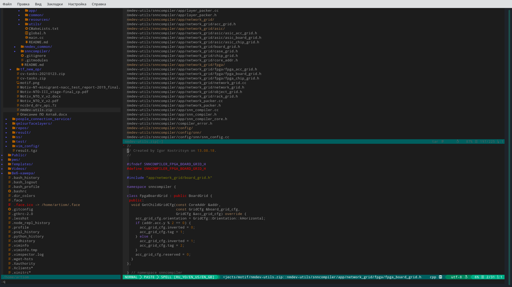

Vim configuration
==================

This is my cross-platform Vim configuration.




Features
--------

- Syntax highlighting (Syntastic).
- Text completion (Youcompleteme).
- Snippets (Snipmate).
- File types settings.
   1. Необязательный шаблон при создании.
   2. Специфичное автодополнение.
   3. Подстветка синтаксиса.
   4. Языковые настройки.

   Основные:
      1. C/C++ IDE.
      2. Python IDE.
      3. Bash IDE.
      4. HTML IDE.

   Прочие:
      1. Ada IDE.


Requirements
------------

- Git
- `Exuberant ctags`

    sudo apt-get install exuberant-ctags


Installation
-----------

- Move your `~/.vim` directory.
- Clone this repository into the some dir and run `install.sh`:

```
git clone https://github.com/artiomn/vim_config.git
vim_config/install.sh
```


Troubles
--------

In the Arch-like systems you must install GVim to support working with a system clipboard.

